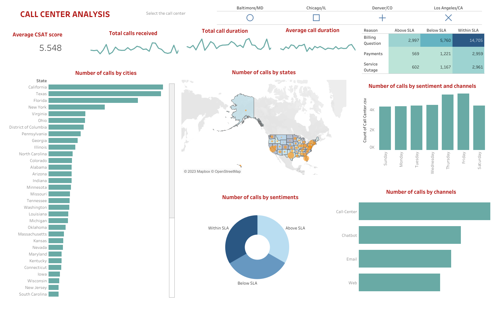

# Call-center-analysis

This interactive Tableau dashboard is designed to analyze and visualize customer interactions, sentiments, and queries, empowering data-driven decision-making for enhancing customer satisfaction.

### Features

- **Sentiment Analysis:** Gain insights into customer sentiments during interactions, helping to identify trends and areas for improvement.

- **CSAT Scores:** Track Customer Satisfaction (CSAT) scores over time to assess the overall satisfaction level.
- 
### Data Dictionary

| Column Name            | Description                                               |
|------------------------|-----------------------------------------------------------|
| id                     | A unique identifier for each record or entry.             |
| customer_name          | The name of the customer associated with the interaction. |
| sentiment              | The sentiment associated with the interaction.            |
| csat_score             | Customer Satisfaction (CSAT) score for the interaction.   |
| call_timestamp         | Timestamp of the call or interaction.                     |
| reason                 | The reason for the call or interaction.                   |
| city                   | The city where the customer is located.                   |
| state                  | The state where the customer is located.                  |
| channel                | The communication channel used for the interaction.       |
| response_time          | Time taken to respond to the customer.                    |
| call_duration_minutes  | Duration of the call in minutes.                          |
| call_center            | The call center associated with the interaction.          |
